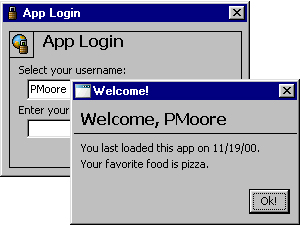



## How to support multiple users in your applications\!

### Description

This small project demonstrates how to support multiple users in your applications. Saves/loads settings from the registry that pertain to specific users. Has ability to create new users. Please vote for me if you find this useful. ANY feedback, negative or positive, is greatly appreciated.
 
### More Info
 

             |
---                |---
**Submitted On**   |2000-11-19 13:01:06
**By**             |[Patrick Moore \(Zelda\)](https://github.com/Planet-Source-Code/PSCIndex/blob/master/ByAuthor/patrick-moore-zelda.md)
**Level**          |Beginner
**User Rating**    |4.0 (8 globes from 2 users)
**Compatibility**  |VB 5\.0, VB 6\.0
**Category**       |[Miscellaneous](https://github.com/Planet-Source-Code/PSCIndex/blob/master/ByCategory/miscellaneous__1-1.md)
**World**          |[Visual Basic](https://github.com/Planet-Source-Code/PSCIndex/blob/master/ByWorld/visual-basic.md)
**Archive File**   |[CODE\_UPLOAD1184611192000\.zip](https://github.com/Planet-Source-Code/patrick-moore-zelda-how-to-support-multiple-users-in-your-applications__1-12951/archive/master.zip)

